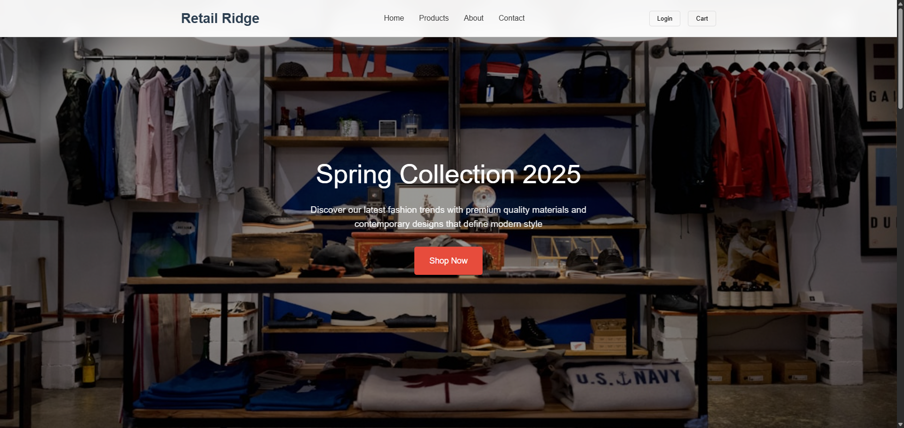

# Retail Ridge - Fashion & Lifestyle E-commerce Store



## Table of Contents

*   [About the Project](#about-the-project)
*   [Features](#features)
*   [Technologies Used](#technologies-used)
*   [Getting Started](#getting-started)
    *   [Prerequisites](#prerequisites)
    *   [Installation](#installation)
*   [Usage](#usage)

## About the Project

Retail Ridge is a modern, responsive, and user-friendly e-commerce website designed for fashion and lifestyle products. It features a clean design, product filtering, and an interactive shopping cart experience. Built entirely with HTML, CSS, and JavaScript, this project demonstrates fundamental front-end development skills without relying on external frameworks or libraries.

The primary goal of this project is to showcase a functional e-commerce front-end, allowing users to browse products, add them to a cart, and simulate a checkout process.

## Features

*   **Responsive Design:** Adapts seamlessly to various screen sizes (desktop, tablet, mobile) using CSS media queries.
*   **Sticky Header:** Navigation bar remains visible at the top of the page while scrolling.
*   **Hero Section:** Engaging full-width banner with a call to action.
*   **Product Display:** Grid layout for showcasing products with images, titles, descriptions, and prices.
*   **Product Filtering:** Filter products by category (All, Clothing, Accessories, Electronics, Home) using interactive tabs.
*   **Interactive Shopping Cart:**
    *   Add products to the cart.
    *   Update product quantities directly in the cart.
    *   Remove items from the cart.
    *   Real-time total calculation.
    *   Cart badge indicating the number of items.
    *   Modal overlay for the cart view.
    *   "Empty Cart" state handling.
*   **Smooth Scrolling:** Navigation links provide a smooth scroll experience to different sections of the page.
*   **Add to Cart Feedback:** Visual notification when an item is successfully added to the cart.
*   **Simulated Checkout:** A basic alert-based checkout summary (no actual payment processing).
*   **Footer:** Comprehensive footer with quick links, customer service information, and contact details.

## Technologies Used

*   **HTML5:** For the basic structure and content of the web page.
*   **CSS3:** For styling, layout, and responsive design.
*   **JavaScript (ES6+):** For interactive elements, dynamic content, product filtering, and shopping cart functionality.

## Getting Started

To get a local copy up and running, follow these simple steps.

### Prerequisites

You only need a modern web browser to view and interact with this project. No special server setup is required as it's a static front-end application.

### Installation

1.  **Clone the repository:**
    ```bash
    git clone https://github.com/your-username/retail-ridge.git
    ```
    (Replace `your-username` with your actual GitHub username)
2.  **Navigate to the project directory:**
    ```bash
    cd retail-ridge
    ```
3.  **Open `index.html`:**
    Simply open the `index.html` file in your preferred web browser. You can usually do this by double-clicking the file.


## To initiate project

* If node is installed, run npm --version in terminal
* Then run
* ```bash
    npm install -g http-server
    ```
* To run server
* ```bash
    http-server
    ```

## Usage

*   **Navigation:** Use the header navigation links to jump to different sections (Home, Products, About, Contact).
*   **Browse Products:** Scroll down to the "Featured Products" section.
*   **Filter Products:** Click on the category tabs (All, Clothing, Accessories, Electronics, Home) to filter the displayed products.
*   **Add to Cart:** Click the "Add to Cart" button on any product card to add it to your shopping cart. A small notification will appear.
*   **View Cart:** Click the "Cart" button in the header to open the shopping cart modal.
*   **Manage Cart:** Inside the cart, you can:
    *   Adjust quantities using the `+` and `-` buttons.
    *   Remove items using the "Remove" button.
*   **Checkout:** Click "Proceed to Checkout" in the cart summary to see a simulated checkout message.
*   **Mobile Menu:** On smaller screens, a hamburger icon (☰) will appear. Click it to toggle the navigation menu.
